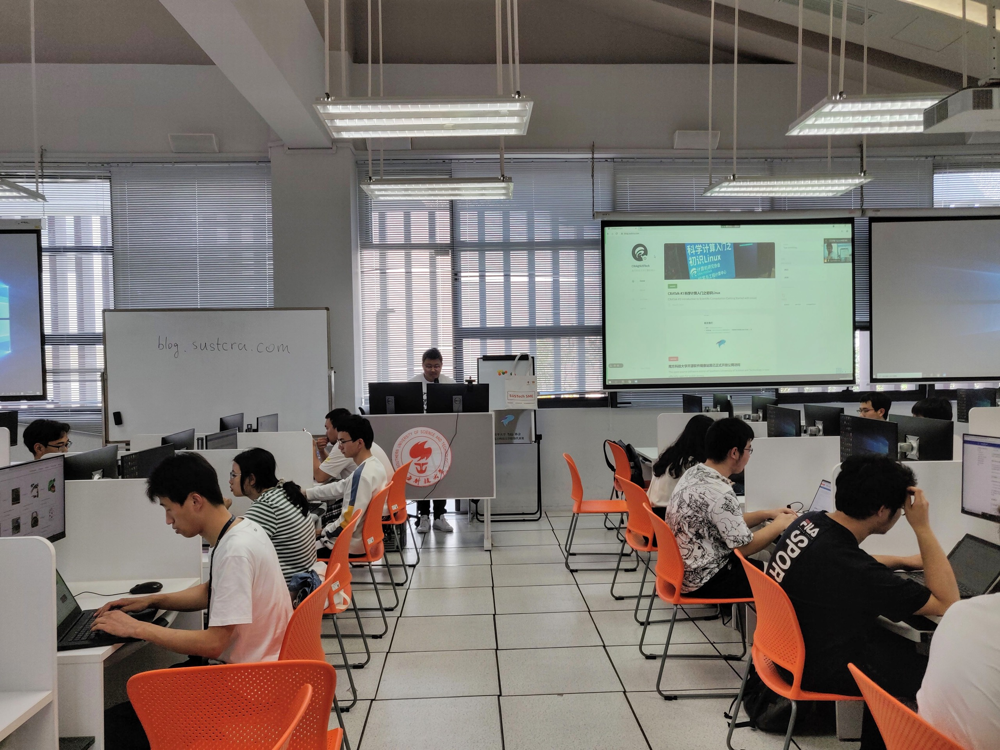
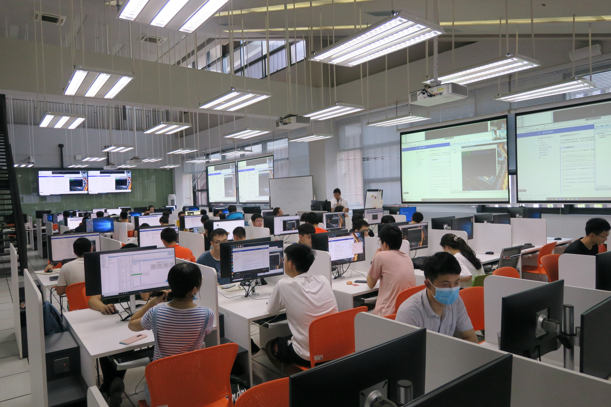
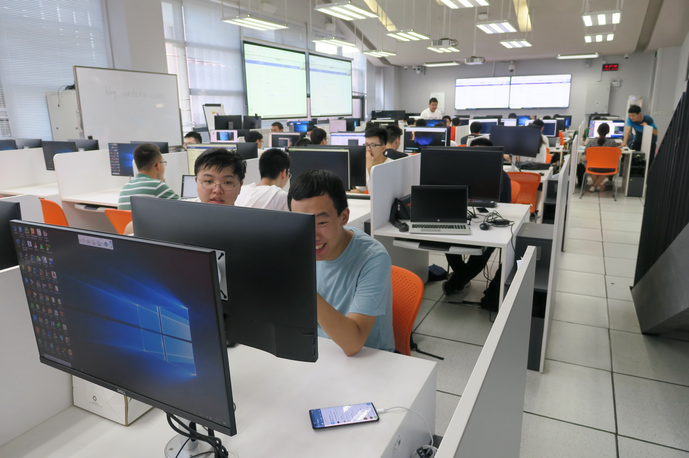
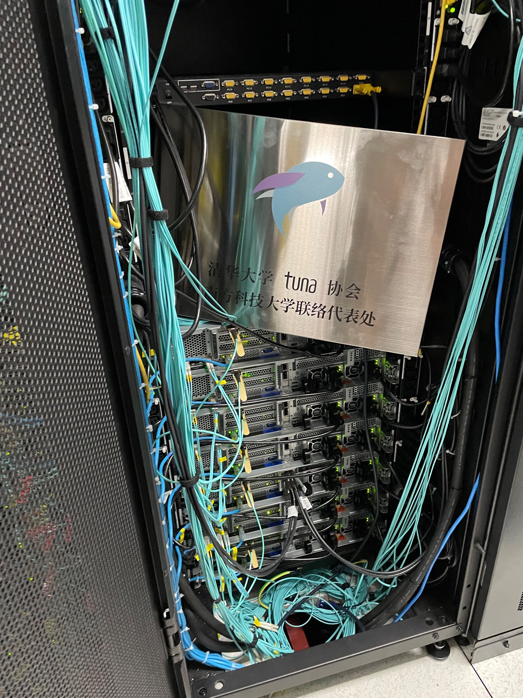
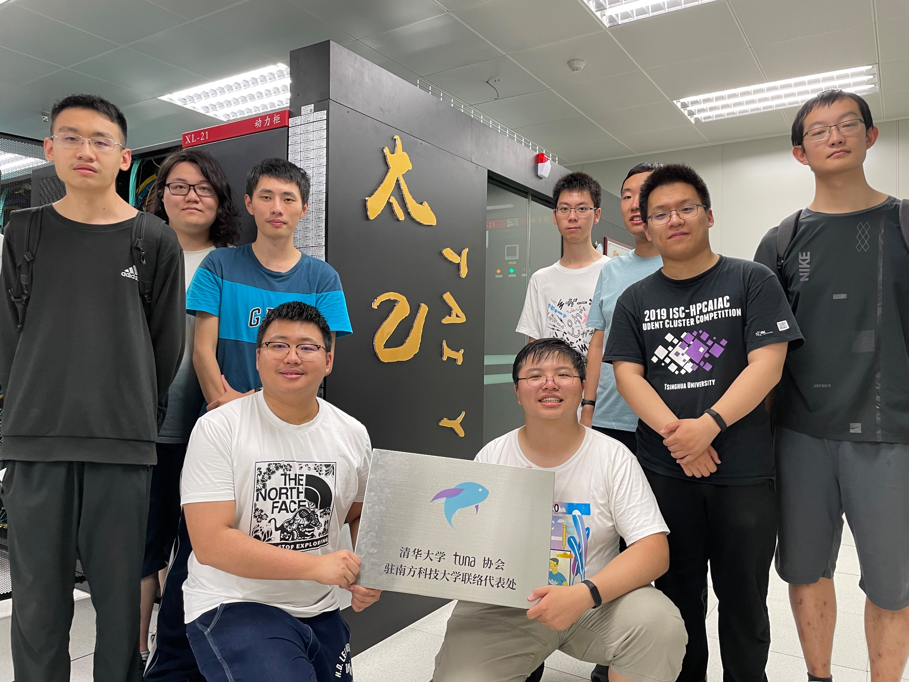

# 计算机研究协会成功举办「Linux入门」讲座

2021 年 5 月 9 日下午，南方科技大学计算机研究协会与超算俱乐部，科学与工程计算中心合作，在二教 2-205 教室举办了科学计算系列基础课程的第一课——「Linux入门」Workshop。

在持续两小时的课程中，主讲人关浩同学通过预先撰写的网页文档，向参加workshop的同学讲解了Linux的历史与发展，终端、桌面环境的概念，目录权限的相关知识和编译安装软件的方式等内容。同时，科学与工程计算中心的汤鸿老师，计算机研究协会的樊青远，张淮化清等同学也为在课程中为同学进行答疑，及时解决同学们在学习中遇到的问题。

同学们借助此机会认识了 Linux 的基本特点，也为大家埋下了中国开源社区的基础。

在活动结束后，[清华大学TUNA协会](https://tuna.moe/)的陈晟祺同学代表TUNA协会来到科学与工程计算中心机房，为「清华大学TUNA协会驻南方科技大学联络代表处」进行揭牌。

哈利同学来到位于慧园的南方科技大学科学与工程计算中心机房，询问数据存储规模、服务器性能等情况。~~他随即从服务器的RAID阵列中抽出一块硬盘，仔细阅读上面的文字说明~~。接着，他询问计算机研究协会的同学，目前发展数据中心遇到哪些困难。计协的同学说，由于慧园聚集了众多计算集群，而网络带宽和电力供应均十分有限，导致服务级别协议较低，长此下去容易抵消这里发展高性能科学计算和开源软件镜像站的优势。哈利说，单台节点服务级别协议较低的问题在包括清华大学在内的每一所世界一流大学中均有存在。但通过巧妙运用热备节点和负载均衡设备，将能在很大程度上减轻节点故障带来的影响。他叮嘱计算机研究协会要加大新型开源软件镜像的支持力度，增加传输通道、提升运行速率、降低运营成本，为华南地区的开源事业持续赋能。

此次活动只是科学计算系列基础课程的第一课，之后将会有进一步的课程举办，欢迎大家前来参加！

