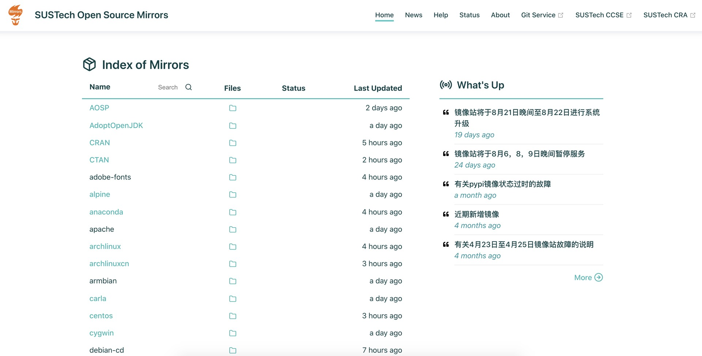
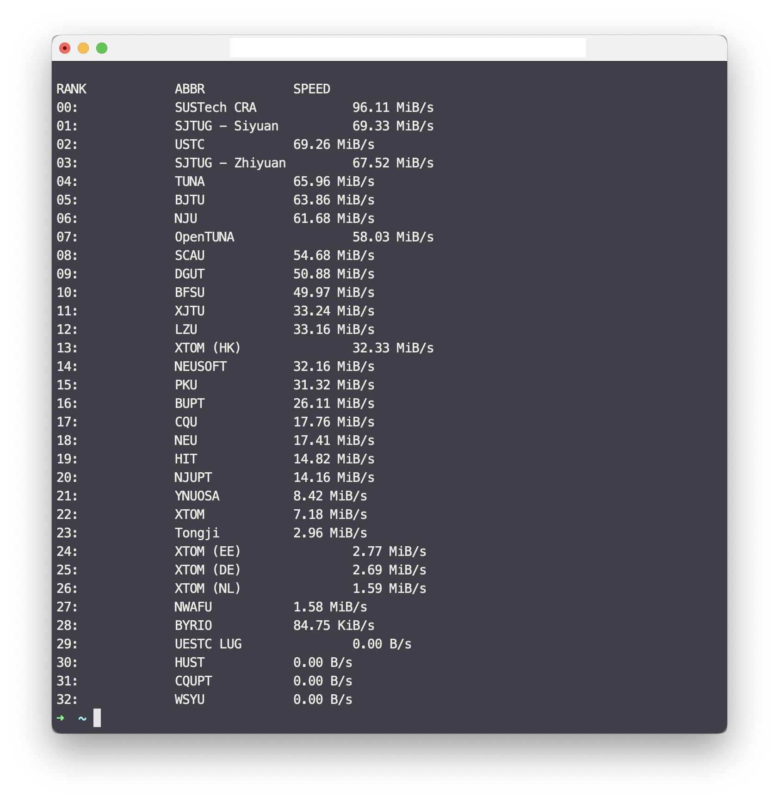
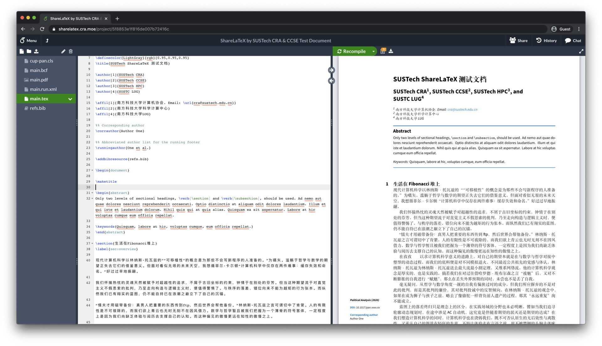
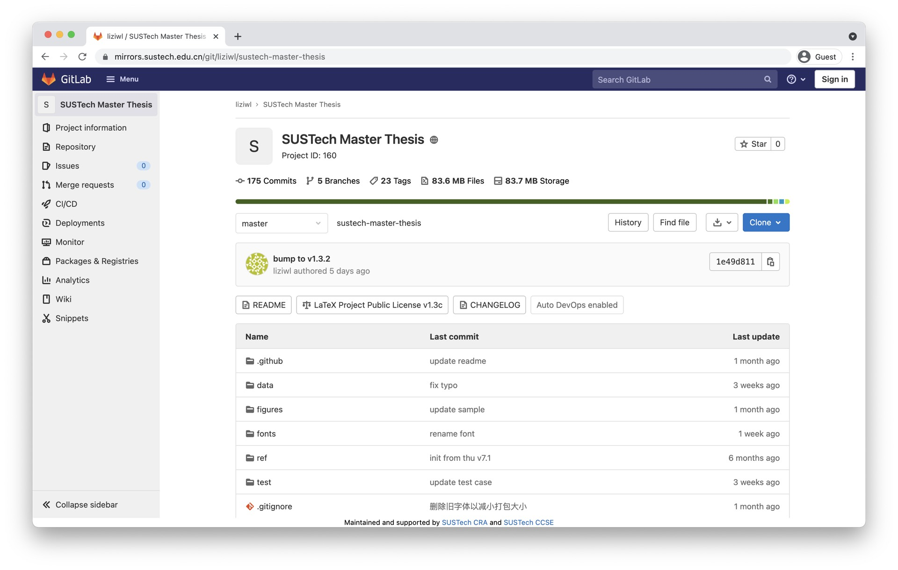
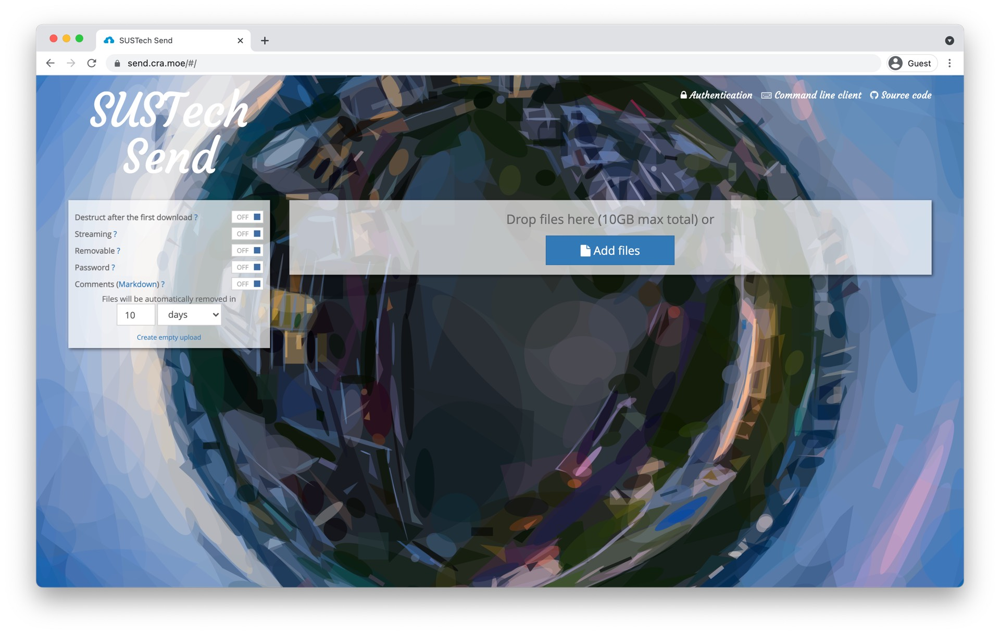
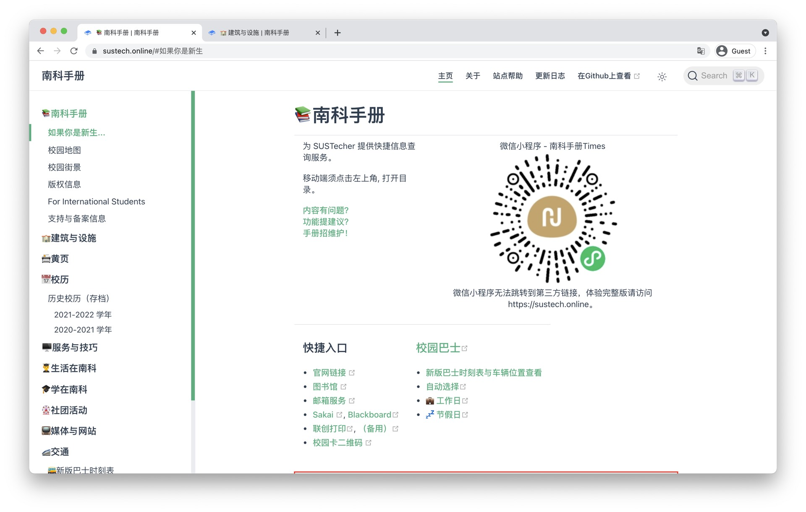
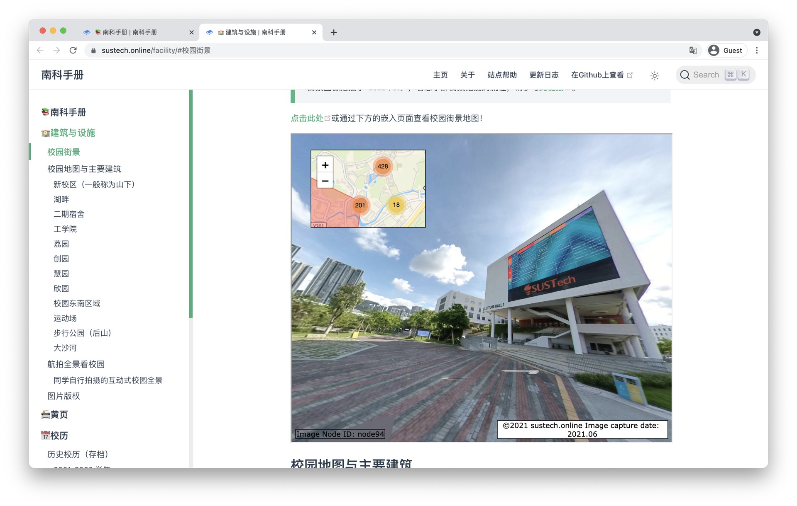

# 欢迎使用南科大镜像站及计算机协会提供的多种服务

在计算机系和科学与工程计算中心的支持下，南科大计算机协会为大家提供了多种教学科研常用的开源软件的下载与软件源服务，同时也向校内提供 git 版本管理，临时文件传输，LaTeX / Markdown 文档在线编辑等服务，详细信息可访问 [https://sustech.online/service/#计算机研究协会-cra](https://sustech.online/service/#计算机研究协会-cra) 进行查看。

## 开源软件镜像站

- [https://mirrors.sustech.edu.cn/](https://mirrors.sustech.edu.cn/)

南科大开源软件镜像站由南科大科学与工程计算中心支持创办，目前由计算机协会进行维护。镜像站中包括了 Ubuntu，Arch Linux，Debian 等操作系统和Anaconda，pypi等常用软件包的镜像。镜像站同时提供了公网 IPv4 和 IPv6 的访问，让您在校外也可以流畅滚包。

## ShareLaTeX

- [https://sharelatex.cra.moe/](https://sharelatex.cra.moe/)

相信对每一位南科大的同学来说 LaTeX 都不陌生，在许多工科课程上，你都能听到他的名字。作为一门排版语言，Latex在数学/工程领域应用颇广，但由于Latex的复杂编译程序，中文支持问题和动辄好几G的软件空间，让不少同学望而却步。往往是纸上写好公式，编译好几个小时。

为了让更多同学体验到 LaTeX 这门排版语言的魅力，并减少大家使用 overleaf 的障碍。南科大计算机协会与科学计算中心合作部署的校内 ShareLaTeX 服务 *（ sharelatex 和 overleaf 已经合并，两者代指的是同一个服务）* 现已上线。本服务基于 sharelatex 的开源版本部署，并添加了完整的中文支持。

ShareLaTeX 服务支持自助使用学校邮箱注册，如需邀请其他外校师生注册，请发邮件至 `service@cra.moe`

## 南方科技大学 Git 服务

- [https://mirrors.sustech.edu.cn/git/](https://mirrors.sustech.edu.cn/git/)

南方科技大学 Git 服务为师生提供支持校内外访问的，基于 Gitlab 搭建的 Git服务。是同学课程协作，代码存储的好帮手。南科大 Git 同时也能和 Github 等外部服务互相同步。

## 软件下载服务

- [https://dl.cra.moe/](https://dl.cra.moe/)

提供多种常用软件的高速下载服务。

## SUSTech Send

- [https://send.cra.moe](https://send.cra.moe)

在内网高速传输文件，最大支持10GB/每次传输。

## Online

南科手册 [https://sustech.online/](https://sustech.online/)

sustech.online 南科手册与学校不同部门，书院，社团合作，为同学们提供了一站式的指南服务。在手册中，你可以方便的找到校园内建筑的概述，常用的QQ群组和部门的电话联系方式，校园网和邮件的实用小技巧和学校周边的交通介绍等内容。

校园建筑：[https://sustech.online/facility/](https://sustech.online/facility/)
* 校内街景视图与介绍。

黄页：[https://sustech.online/contact/](https://sustech.online/contact/)
* 常用的QQ群组和部门的电话联系方式。

校园巴士时刻表：[https://sustech.online/transport/bustimer.html](https://sustech.online/transport/bustimer.html)
* 与校园服务办公室合作，内置了校园巴士的到站时间表和实时位置功能以方便大家的出行。

应急处理：[https://sustech.online/emergency/](https://sustech.online/emergency/)
* 与应急救援队合作发布 “应急处理” 页面，提供紧急情况下标准作业程序 SOP，分发应急手册和AED地图。

2021迎新特辑：[https://sustech.online/if-you-are-a-freshman/2021.html](https://sustech.online/if-you-are-a-freshman/2021.html)

* 2021年与致诚书院合作发布迎新特辑，为新生准备的 Quickstart of SUSTech，开启大学生活。

---
若同学们对上述服务有任何意见或建议，或希望添加新的服务形式，欢迎向`cra@sustech.edu.cn`发送邮件或在论坛 [https://c.cra.moe/c/cra-service/6](https://c.cra.moe/c/cra-service/6) 进行反馈。

---
P.S 我们将在百团大战时出摊招新，敬请期待～

也欢迎大家关注我们的微信公众号和网站：

