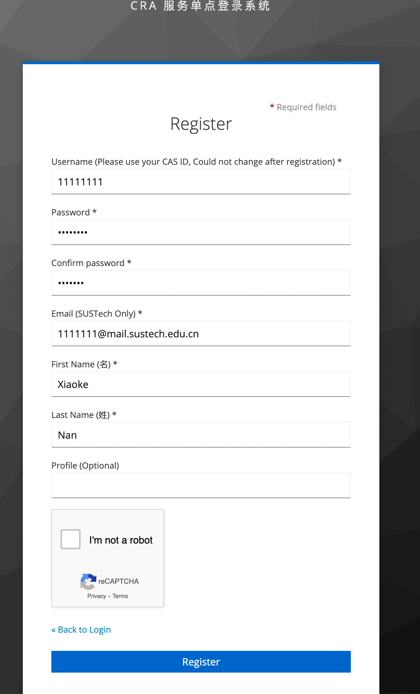
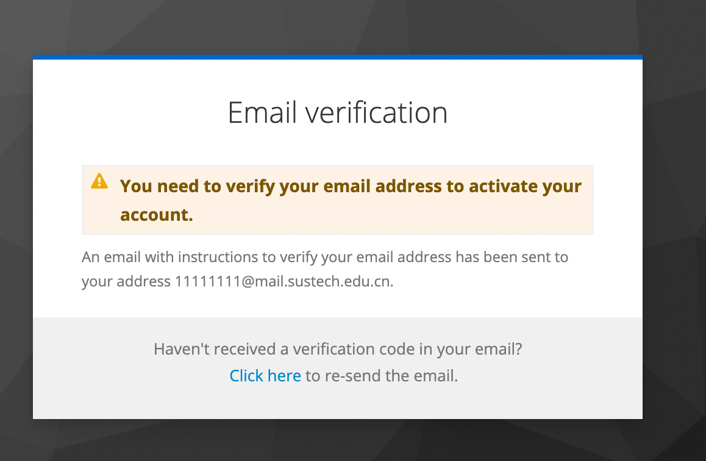

## 关于CRA-Sharelatex切换域名及启用LDAP的说明

对Sharelatex的升级将带来以下改变：

### 域名更换

CRA Sharelatex的校内外访问域名将统一更换为 [sharelatex.cra.ac.cn](https://sharelatex.cra.ac.cn) 。原先的旧域名将会自动重定向至新域名。

### 中央登陆

sharelatex的账号管理系统将迁移至CRA维护的LDAP中央认证服务。

在升级完成后，新用户需要使用CRA SSO（[https://sso.cra.ac.cn/realms/cra-service-realm/account/](https://sso.cra.ac.cn/realms/cra-service-realm/account/)）进行注册（注册指南请见下方），**现有用户依然可以用sharelatex上的账户密码登录**。注册CRA SSO后，用户可以使用CRA SSO注册时填写的邮箱和密码登陆sharelatex。

如果需要为没有南科大邮箱的同事注册Sharelatex，请将希望注册的邮箱发送至 `service@cra.moe`，管理员看到后将会手动帮忙注册。

推荐现有用户在升级后在CRA SSO注册账户，并使用其中的邮箱和密码登陆。**未注册CRA SSO的用户仍然可以通过本地账户和密码登陆**。但重置密码的操作需要通过CRA SSO进行。

## 其他CRA服务的认证迁移计划

CRA将于2022年9月起逐步迁移CRA的其他服务使用CRA SSO登陆。在迁移时，我们将会至少提前一周进行通知。

## CRA SSO 注册指南

首先，打开 [https://sso.cra.ac.cn/realms/cra-service-realm/account/#/](https://sso.cra.ac.cn/realms/cra-service-realm/account/#/ ) ，点击右上角的“Sign in，再点击“Register”进行注册。

输入用户名（请使用cas id，如11800001/3000001，注册后无法更改），邮箱（学生请使用数字为用户名的邮箱），密码及姓名（姓名请用英文，可随意，但相关姓名会同步显示在sharelatex中），并完成reCAPTCHA后即可注册。

在验证邮箱后，账号即被激活，并可使用。

注册完成后如需改名，可在登入后于 **Personal info**处更改个人信息。
