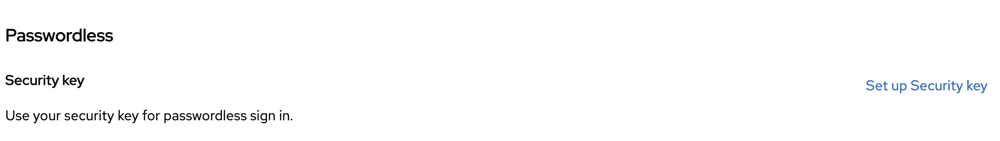
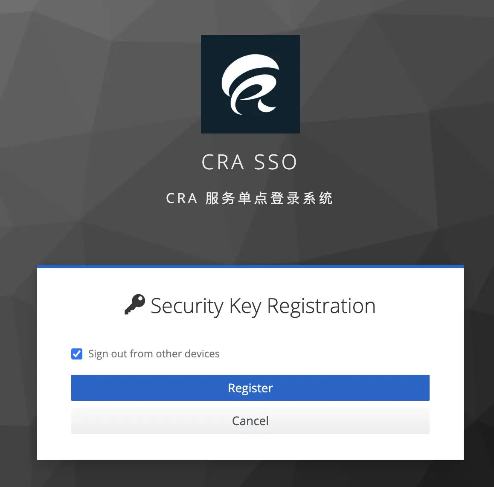
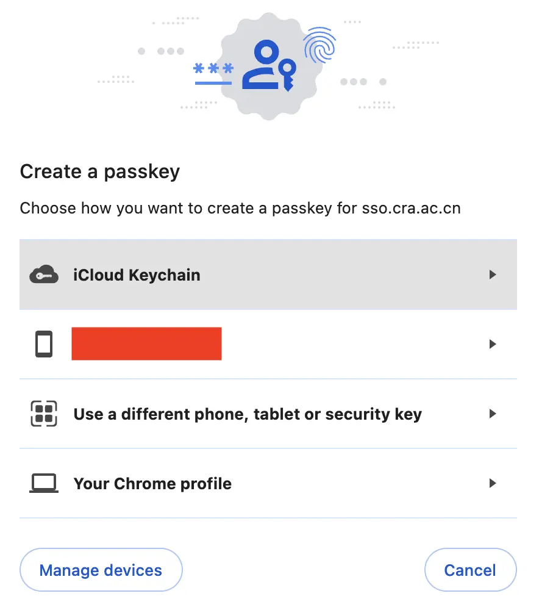
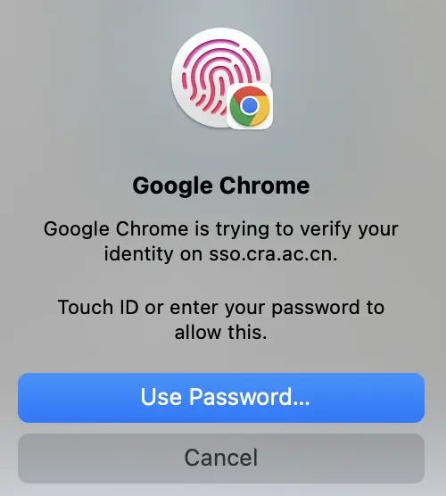
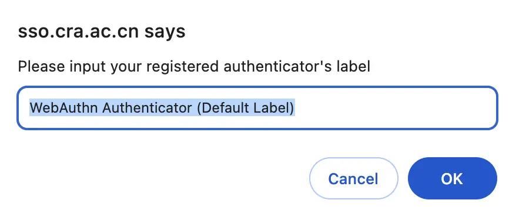
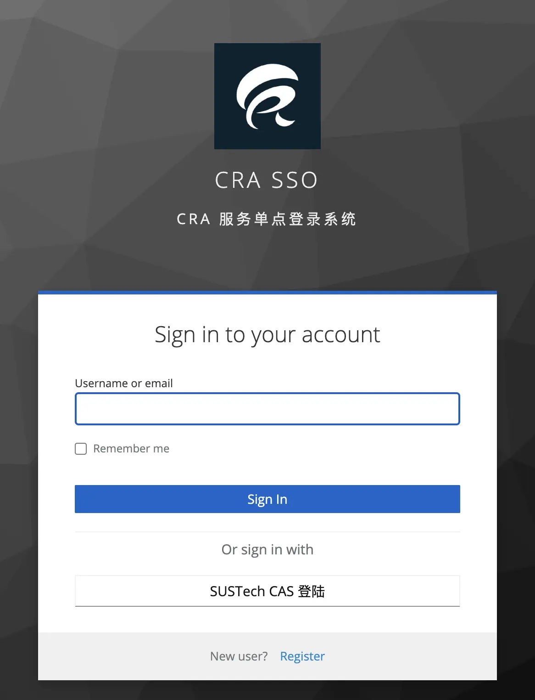
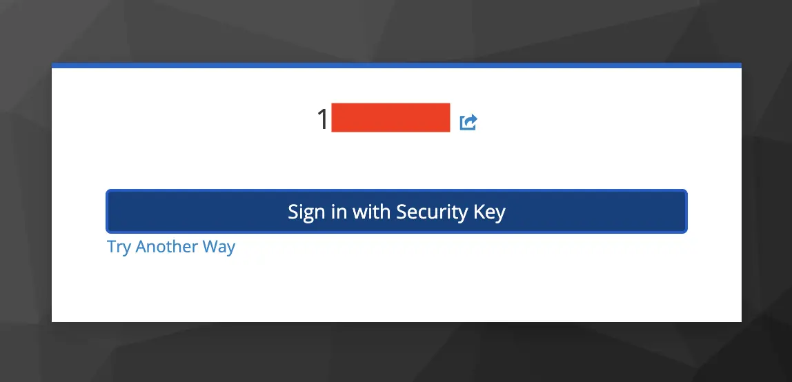

# CRA SSO现已支持PassKey登陆

CRA SSO已于近期升级至Keycloak 23，并藉此契机支持了PassKey标准。现在，您可以使用指纹或安全密钥一键登陆您的帐号，而无需输入密码。

## 注册passkey的流程

1. 点击[此链接](https://sso.cra.ac.cn/realms/cra-service-realm/account/#/security/signingin)访问cra sso的用户中心。

2. 在Passwordless一节中，点击右下角的Set up Security key

   

3. 点击Register

   

4. 根据您持有的设备选择是在本地还是手机，平板上存储密钥：

   

5. 随后根据设备的提示选择指纹/PIN/安全密钥认证

   

6. 认证成功后，选择一个自己好记忆的名字（会显示在My Account中）

   

## 登陆

在用户名处输入你的用户名（学工号）或邮箱

   

点击“Sign in with Security Key”：

   

在本地完成认证后即可登陆。
